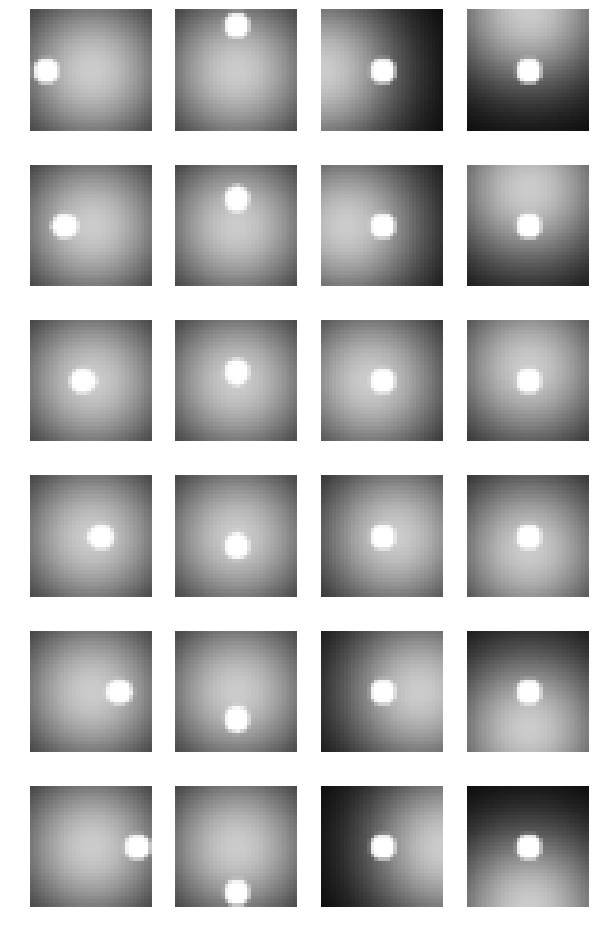

# Analyzing disentanglement of visual objects in semi-supervised neural networks
## Andrew D Zaharia and Benjamin Peters, John Cunningham, Nikolaus Kriegeskorte
### [Presented at the Conference on Cognitive Computational Neuroscience 2019](https://ccneuro.org/2019/proceedings/0000117.pdf).
### Project for Deep Generative Models (STAT 8201)

## Introduction

A fundamental goal of visual systems is to condense images into compact representations of the relevant information they contain. Ideally, these representations would consist of the independent “generative factors” that fully determine, on a semantic level, the visual input. Such a “disentangled” representation could factorize the identity of a background scene, and the identity, position, pose, and size of an object. Recent research in deep neural networks (DNNs) has focused on achieving disentangled representations, through unsupervised learning, of single objects or faces in isolation.

### Autoencoder architecture

We trained and analyzed a popular, unsupervised DNN model of disentanglement, the β-variational autoencoder (β-VAE), which uses β to trade off reconstruction error and the KL divergence between the posterior and the prior on the latents (typically a standard normal distribution). β acts as a regularizer to reduce the capacity of the latent
bottleneck z to encode information.

  

  

### A perfectly dientangle-able task
We trained the networks on a new dataset, with each image (32x32 pixels) containing a “foreground” white circle and “background” isotropic Gaussian.

  

### Control: supervised learning with encoder
First we trained the encoder network with supervision to map its four latent variables directly to the generative factors. The encoder network has four convolutional layers, each with a stride of 2, and a rectified linear (ReLU) output nonlinearity, followed by a fully connected layer that maps to the four latent factors. Here we see that this architecture is capable of representing the underlying generative factors with perfect disentanglement.

  

## β-VAE with lower β yields better disentanglement on this task
On our dataset, higher β values result in higher reconstruction loss and greater entanglement. We hypothesize that further inductive bias is needed to achieve better disentanglement, such as a representation which has stable dynamics.

  

  

## Adding dynamics: regularizing with error of linear prediction on latents
We extended the task to be dynamic: the white circle linearly translated in front of a static Gaussian background. The position of the Gaussian still changed across samples. Each sample was 10 frames.

We tested a variant of the β-VAE with an added regularization term that
penalizes latent representations that deviate from a linear trajectory.

  

  

## Representational inertia: latent predictions and input encoding determine future latents via recurrent connections
We tested a variant of the β-VAE with a recurrent latent computation that combines predictions on the latents from linear interpolations of the previous latents with previous latents generated from the encoder – all with biologically plausible conduction delays. Here we used the “vanilla” β-VAE objective (first equation above) with:

  

  

  

With 4 latent variables, reconstructions were reasonable, with small errors lagging behing the foreground circle's direction of motion, for β=0 and all γ below 1. When γ=1, the network ignores inputs and "dreams" a static scene. Synthesizing images along sweeps of individual latents show (non-axis-aligned) disentanglement.

  

